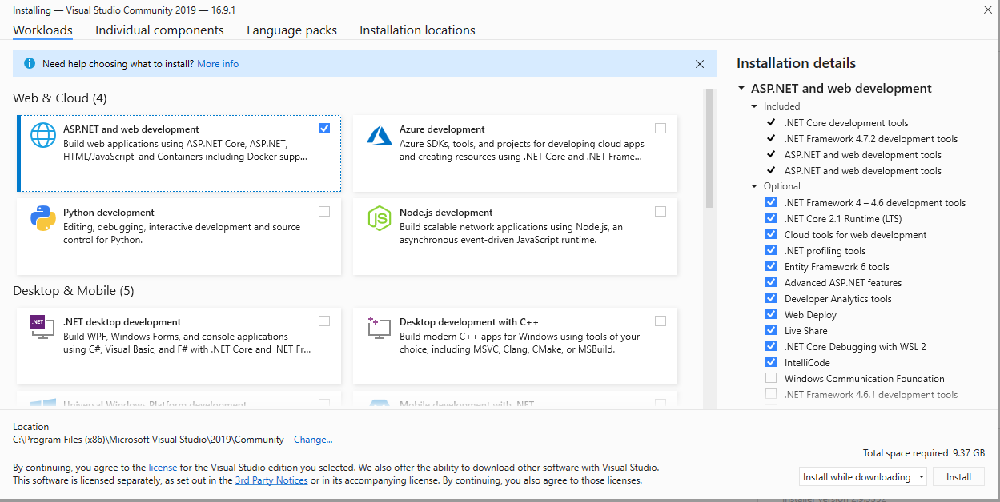
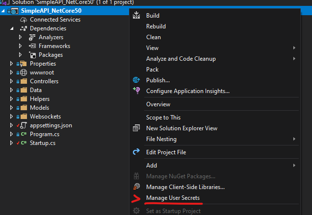

#  .NET Core 5.0 Simple API
A simple API built using .NET core 5.0, that uses the entity framework to store and retrieve data items, and websockets for two-way sessions.

## QuickStart / Development Setup
1. Install Visual Studio 2019 with the "ASP&#46;NET and web development" workload.

1. Clone the repo.
1. Generate a user secrets file by right-clicking on the project in Visual Studio and selecting "Manage User Secrets".  

1. Add a "ConnectionStrings" definition with a "development" property into the generated `secrets.json` file:
    ```
    {
        "ConnectionStrings":
        {
            "development": "Data Source=[dev server name];Initial Catalog=[development db name];[authentication method/credentials]",
            "example": "Data Source=EXAMPLE;Initial Catalog=ExampleDB;User Id=apiUser;Password=supersecretpassphrase;",
            "integratedExample": "Data Source=EXAMPLE;Initial Catalog=ExampleDB;Integrated Security=true;"
        }
    }
    ```
    _[Note]: You can find more examples of connection strings [here](https://www.connectionstrings.com/sql-server/)._
1. Run the project.
1. Navigate to `~/swagger/index.html` for the OpenAPI documentation or `~/apps/api-tester/index.html` in order to test functionality that requires state, like video chat, secure data, or file uploads.

## Website Installation
This project is set up to take advantage of Visual Studio's packaging and exporting functionality. As this facilitates many methods of installing and hosting a website, please see [Microsoft's publishing documentation](https://docs.microsoft.com/en-us/aspnet/core/host-and-deploy/?view=aspnetcore-5.0) for more information on the specific method you would like to use. 

## Overview
This project is a personal ease-of-use project which aims to define a "starter project" for myself that utilizes viable patterns for common tasks, such as remote data storage (server DB), a REST API for remote execution, websockets for real-time communication, and a peer-to-peer client. None of the code in this repository should be considered "production-ready". This is fairly sloppy code used to exemplify what is hopefully an "easy to follow" pattern for each of the project's goals. And while this documentation doesn't seek to fully document the project, it does intend to provide enough information to be useful in seeking out answers from their individual sources.

As a rule of thumb, I tried to avoid libraries and to use the most widely-used, widely-tutorialized libraries for things that couldn't avoid it. For the most part, that meant using Microsoft dependencies for things like the Entity Framework, but I did use a more generic "websockets" library.  
All libraries are being managed by the NuGet package manager, so they should all download and compile "just in time". As far as other repos are concerned, this project does not have any outside dependencies.

The project is written entirely in .NET Core 5.0, in an effort to make it cross-platform. So far, this has only been tested on Windows, but this repo will be updated when the project has been proven to work in non-Windows environments.

_[aside]: A lot of the notes in here are just to remind myself what things are or why they were done a certain way._

##### A note on using Entity Framework
Normally, I would avoid locking a template project, like this, into a single data paradigm, which is exactly what forcing the Entity Framework does. The rationale here, though, is that if I wanted to start up a project ASAP, it's far more likely that I'll need to set up account management than not. So, if my intent is to get something created quickly, I don't want to have to worry about the various forms of account management (and the security that goes along with it). So the Entity Framework provides a simple way to integrate battle-tested account management libraries. And since the Entity Framework doesn't actually preclude working with other types of data, any friction caused here can be mitigated by a wholesale implementation of some other data source, which would have to be done, either way.  
Simply put: it's easier to work around or rip out the Entity Framework than it is to get it integrated after the fact.


## Features

### REST API
The REST API has been implemented to handle common CRUD functionality, as well as more complex functions like establishing server sessions and handling binary content. This has mostly been implemented using best practices (as far as I could tell).

As such, common REST patterns are used in all of the controllers and routing is handled in the `Startup.cs` and `Program.cs` files.

#### Threading
In keeping with best practices, this project uses the asynchronous `Task` paradigm for requests, which allows the dotnet runtime to smartly manage resource allocation. This should make the server run quicker and force data-handling methods that are well-suited for distributed computing. 

#### Controllers
This section provides a general overview of each controller's purpose and usage. It is not meant to describe the specific methods and integration points of the API. For that, please use the OpenAPI live documentation provided within the project, as the more dynamic presentation allows for an easier development experience (and - not for nothing - it prevents me from having to document a project that has already been documented by robots; I welcome our metal overlords).

- Account  
This controller handles basic registration and login functionality. It doesn't handle logout functionality because the implemented authorization accepts any valid tokens, so it is up to the client to prevent the token from being sent to introduce the state of "logged out". A real implementation of this controller would need to invalidate tokens, once a method for that has been decided for the project.

- Application  
This controller provides functionality for getting and setting application-level data such as the app version or handling remote logs (though, only version has been implemented).

- Assets  
This is a helper controller for handling the retrieval of any files that have been uploaded to the server via the `StreamingController`, or that have been elsewise stored in the file data store. In this project, that's just a folder on the server, which can be configured in the `appSettings.json` file.

- DataItem  
This is an example controller to show CRUD functionality for an Entity record. It exposes storage for strings that can be identified by a key. For the most part, this can be used to store JSON data or other simple strings, for easy/quick lookup. For most data, though, this is too simple to be useful.

- Error  
This controller is a helper that is not actually a part of the REST API, from a client perspective. Rather, it's a hidden bit of routing that the server can throw to when an error occurs which can be used to normalize error messages that get sent back to the client.

  This controller can also check for environment, so it can be used to send useful information to the client when in debug mode, and only error codes to the client when in production mode.

- Streaming  
This controller provides endpoints for streaming file uploads to the server. By using the file handler utility, this controller establishes a websocket session which can be accessed by the client for progress updates. It also provides an endpoint to cancel any uploads that are currently in progress.

- Websocket  
This controller gives clients a way to establish a websocket connection with the server through the API.

  It provides a simple get method for creating a session, as well as a post method that shows an example of how to pass in initializer data for the session.

### Remote Data Storage
This project, by default, initializes an Entity Framework `DatabaseContext` object via a configuration file, which establishes a data paradigm of using a data model object and allowing the Entity Framework to facilitate the storage of that object's data into a table or tables within a MSSQL database.

#### Data Item
The project defines a `DataItem` object which acts as a Key-Value pair for simple data storage and retrieval. This can be used for simple data storage needs, as well as act as a simple test for DB connectivity.

#### Advanced Data Models
As with any REST API, nothing in this project precludes more advanced data modeling. In fact, the account management exemplifies something with slightly more complexity.  

With the Entity Framework, you can simply introduce more Data Objects into the model and it will handle breaking them out into tables and columns. It means less thinking about your data structure, and more thinking about your object structure. So that's usually a good thing.

If that's not workable, though, the database can be accessed via a connection string using the standard techniques for doing so in .NET.

### Account Management
This project implements the `Microsoft.AspNetCore.Identity.EntityFrameworkCore` Package and uses that library to manage account registration and authentication. This is a distributed authentication model that uses JWTs and request origins as a means of authorization. The project is not currently set up for distributed serving, but this method of authentication allows for an easy transition to that model.

Accounts and Roles are all managed via the `AccountController` and follow a pretty standard login/register pattern. The `AccountManager` class supplies some pretty straightforward functions like `CheckPasswordAsync`, so any changes to the way accounts are handled should be easy to implement.

As the `AccountManger` relies on the Entity Framework, the actual account data is stored in data model objects in the `Authentication` namespace. You can use the `Account` object to add additional fields, and the `AccountRole` object to adjust the available roles you want to support.

### Websocket RTC
This project exposes websockets for using in various real-time operations. With the websocket implementation, data can be sent bi-directionally from server to client and vice versa.  
All websockets are managed via "sessions", which are long-lived objects on a server. This paradigm is not valid for distributed computing models, but works well for single-server applications like this project.

#### Starting a session
A websocket session can be started via the REST API's `WebsocketController`. The client requests a websocket using an API call and is given a session id in response. Then, the client makes a websocket request (`wss://`) using that session id in order to establish the native javascript `WebSocket` object. This object can then be used to listen for websocket traffic, as well as send data to the server with the websocket.

A session can have as many client members as the server can support. Once a session has been established, any client can connect to it using it's session id. In order to gate this, logic would need to be added to either handle access at the server level, or have the server reach out to the session starting client and ask for permission.

#### Attributes
Websocket sessions can store arbitrary data objects by way of the `ProcessArtifact` utility object. An "artifact" in automation parlance is any arbitrary piece of data that is produced by some process. This can be a data file or an executable or a string or anything else. It's just a way to identify the 'result' of a process.

Because of the decentralized paradigm of this project, there are different processes that may be handling a REST API request and a websocket session. In order to have data carry from one to another, the server has been made responsible for managing artifacts between disparate processes.

As a result, a REST API request to initiate a websocket may also introduce some piece of data, like a unit total for a progress session. That data is then packaged as an artifact and given to a websocket session. Then, when a client connects to that websocket session, the session can return the unit total along with the current amount processed without having to generate or estimate it.  
These artifacts also facilitate the chat messaging and, naturally, can be used to provide interoperability to anything that the server can access.

#### Messaging
Websockets aren't much use without some implementation of messaging. This project implements basic JSON serialized messaging, obfuscating most of the binary translations to text. It does, however, handle those binary translations, so if there are different standards that need to be applied, you shouldn't need to make any changes to library code.  
The messaging implementation includes ease-of-use functions like methods to send messages to all peers, excluding the sender.

On top of the basic messaging paradigm, this project also implements a simplistic websocket-based chatroom (as opposed to a p2p chatroom that signals with websockets). All chat messages pass through the server and the chat ends for a client when the websocket closes for that client.  
To facilitate this chatroom, basic helper functions and objects have been included such as enums to handle chat message types, and message passthroughs.

#### Progress
Using the basic messaging implementation, this project goes further and provides a progress implementation, as a way to showcase a websocket use-case that can work in distributed systems.

In this example, progress has been implemented as a way to track the upload of a file from a client. The client provides a file to upload, using the Stream endpoints in the REST API, and that initiates a websocket session to alert the client about the file progress. The client can use the returned session id to connect to the session and receive messages containing a progress report.

Unlike the basic messaging implementation, this example prevents the connection of any clients after the first connection. It doesn't distinguish who that client is, so it is still subject to interference, but it gives an example of access-gating which can naturally be expanded upon.

### Peer to Peer RTC (WebRTC)
This project includes in the api-tester an example of using the Websocket's real-time messaging as a signaling channel for a WebRTC application. You can find more information about what a signaling channel is, or what WebRTC is, [here](https://webrtc.org/).

#### Video Chat
The API tester contains a video chat app which utilizes WebRTC. This app works by establishing a websocket session with the server, then using that as a signaling server to relay peer messages from the chat host to the chat clients. Due to the nature of connections on wide area networks, this project only works on LANs, via a free, testing STUN server url.

This app is unique in this project, in that there is no reason it needs to be tightly coupled to the server part of this project. As such, the video app really *should* be a project all on its own (and will be in the future). But because writing the app as having a well-known signaling server is easier than making it agnostic, this app IS tightly-coupled with the server project.

As such, the signaling server and the shape of its messaging define how this video app works. That means that the chat may become unusable if the websocket connection closes. Unlike the chat messaging, though, any peer to peer connections that have already been established should still work independently, even as the websocket connection fails. 

In the future, this project may be updated to de-couple the signaling server from the video chat app and provide an example for re-establishing signaling from the host, should websocket connections close. But it doesn't now. Because you just can't to everything all at once.  
(and, to be completely honest, WebRTC kicked my ass for a long while and I'm very happy to be done with it, at the moment.)

### OpenAPI
This project includes the `Swashbuckle.AspNetCore` package which implements the OpenAPI standard for generating a live-documentation page. The implementation from that package is the [Swagger API](https://swagger.io/), which I find to be a really robust and easy-to-understand design.

This project has gone beyond the default implementation and also added custom schemas via the `DocumentFilter` in the `Startup.cs` file. Doing so allows all data contracts and object models (including the REST request and response objects) to be described in the live-documentation.

## Configuration
The configuration of this project is kept in the recommended areas for both integration and security. As such, it employs configurations in a `launchSettings.json` file, as well as in an `appSettings.json` file and a `secrets.json` file. Most configuration options should be found in these files, with the exceptions being things that this project uses as examples or defaults, such as the name of the database and tables, or the option to use OpenAPI (Swagger). Those kinds of settings can mostly be found either in `Startup.cs`, `Program.cs`, or in their respective code files (`DatabaseInitialzer.cs` for DB stuff, etc...)

### launchSettings.json
This file defines values that help other programs initialize the website. Multiple profiles can be created which can be used by VisualStudio to launch the website under different conditions (such as "Development" or "Release"). I'm sure this file is utilized by other software (like VS Code), but I haven't tested it anywhere else. I just know it works for VisualStudio.

Some default profiles exist, including two development profiles - one for launching into the OpenAPI REST live documentation, and one for launching into the app-tester app - and a release profile.

### appSettings.json
This file stores the majority of the configuration settings for the website/API. It can be accessed using Microsoft's default `IConfiguration` service injection, so any data that needs to be configurable can be stored here, and retrieved with a simple `property:subproperty` structure at runtime.

This file contains JWT configuration settings that manage how the authorization is handled by the app. There are a lot of different ways to implement JWT authorization, so this project is using a method that may not work for your purposes. If you need to make changes to how the JWT authorization works, see the [Microsoft library documentation](https://docs.microsoft.com/en-us/aspnet/core/security/authentication/?view=aspnetcore-5.0).  
To use the available configuration, the "PrivateKey" property is, basically, a password. It's just some phase or key that the library can use to secure your tokens. I would suggest generating a strong one ([like from here!](https://www.grc.com/passwords.htm)), but it can be pretty much anything.  
The other two properties, "ValidIssuer" and "ValidAudience" are, essentially, just things for the library to check claims against. One of the claims that comes in will be "iss" and that claim will be checked against the value in the "ValidIssuer" property. But the library generates the token with that claim, based on this configuration, so it all pretty much happens behind the scenes. You don't really have to worry about this much. In a lot of cases, both values can be the same, because the client and the API will exist on the same domain.

### secrets.json
The promoted way to handle database connection strings, or any other information that you don't want to share, is to use a `secrets.json` file. Access to these secrets can be exposed to the injected `IConfiguration` service by introducing a `<UserSecretsId>` element into the `<PropertyGroup>` of the `.csproj` file, and then placing a `secrets.json` file into the secrets location for your OS(1) that defines properties in the same way that `appSettings.json` does.

More simply: you can use the secrets manager provided by the .Net Core SDK to add and remove user secrets via the command line, which will create that file and link it to the project.

Once you've established secrets, the properties there can be accessed in the same way as the properties from the `appSettings.json` file.

For more information, see the [Microsoft `secrets.json` page](https://docs.microsoft.com/en-us/aspnet/core/security/app-secrets?view=aspnetcore-5.0&tabs=windows)

_(1): `%APPDATA%\Microsoft\UserSecrets\<user_secrets_id>\secrets.json` on Windows, `~/.microsoft/usersecrets/<user_secrets_id>/secrets.json` on Linux/macOs._

## FAQ
#### When I added a new table to the Database Context, I got errors.
This project has not implemented a method for updating a database schema via the Entity Framework. On startup, it will implement all the tables needed for the definitions in the `OnModelCreating` function, but once the model is created, it won't use the model creating function to update the schema.  
As it stands, the only way to update the schema would be to delete the database to remove the existing schema and then recreate it so that the startup will generate the new tables needed.

Obviously this isn't the expected way to do things, but updating the schema can be implemented using a couple of different methods, so this project leaves that implementation up to the use-case. For information about methods of updating the schema, see [Microsoft's Entity Framework Schema Management documentation](https://docs.microsoft.com/en-us/ef/core/managing-schemas/).

#### The `api-tester.html` file's UI[...]
The UI for the api-tester is not really there to look good. It's built to be obvious and straightforward, while providing sensible layouts for common practices. Whatever flourishes that were added were mainly applied for either practical functionality (transition effects for saving real-estate) or classification (colors are good memory-adhesives).

If there's something in the UI that causes the tests to be unable to function, please file an issue! But if it's just that something causes it to be super janky and break what was clearly the intended look and feel, that's not really going to be a high priority for me. The API Tester is just that - a tester. As long as it can test, I'm fine with it.

#### The video chat doesn't work on a wide network!
Nope! Sure doesn't!  
Unfortunately, that is by design.
In order to establish Peer-to-Peer connections, there has to be a third-party server somewhere to let everybody know everybody else's connection information. These are called STUN or TURN servers, depending upon what exactly they do. This project implements a STUN server, because there are open STUN servers provided by big players like Google for testing stuff like this. But when you get out into the internet, the chances of a STUN server being enough to get you the right connection data drop dramatically. So, at that point, you need a TURN server. And TURN servers are harder to find testing urls for. So, this project has elected not to implement any TURN servers, as it's not necessary for LAN testing, and when you get to WAN testing, you should either set up your own TURN server (fairly niche), or pay someone to use their TURN server (fairly reasonable).

#### Video chat doesn't work on mobile!
[Nope! Sure doesn't!](https://github.com/catapart/dotnetcorefive-simpleapi/issues/50)  
At the moment, I haven't even looked at it, and it isn't a priority for me. It's just on the list. But feel free to take a crack at it, if you're interested in that goofy debugging setup you have to do where you connect your phone to an instance on your PC just in order to get a console error. Otherwise, I'll get around to it when my plate clears up.

#### new project who dis?
If you have any questions, feel free to ask in the issues or comments areas and this will be updated as is appropriate.